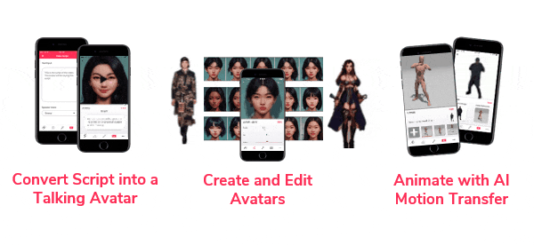

## Inspiration

After the pandemic, our lives becomes more digitalized and video has been more commonly used as a medium. However, making videos is still difficult as ever. You need to learn video editing and filmmaking, rent studio and actors, and buy expensive equipment. In this project, we want to make video production easier, cheaper and faster for everyone with the help of AI.

## What it does

Gancreate enables everyone to make videos easily. Users can quickly convert a script into an editable talking avatar and also animate it using AI motion transfer. Currently, there are 3 types of avatar, face portrait, full body 2d characters, and full body fashion models. Users can easily generate a unique avatar  using our AI models. Furthermore, you can edit its attribute such as gender, age, realism and even mix between two avatars. Once you created an avatar, simply give a script or reference video as an input and the app will animate it accordingly.

### Text2Art
Additionally, we also created Text2Art feature. In this feature, users can easily generate an art just from a text input. Text2Art can generate all kind of arts from pixel art, drawings, photos, to paintings. In addition, Text 2Art also generates a video showing the process of how the art is generated. In the future we plan to further improve and integrate Text2Art with our animation tool so that users can edit the avatar's appearance and emotion with just text instruction.

We initially launched Text2Art as a webapp at [text2art.com](https://text2art.com/) and gained over 100+ active users and generated more than 300 arts in less than a week (29 Aug - 5 Sep). Afterward, we integrated Text2Art as one of Gancreate feature.

## How we built it
### Data Collection
We first created 3 new image datasets to train our generative models. The reason we created a new dataset is that, there were no public StyleGAN for face modern art portrait and full body images.
The dataset was collected by web scraping the internet using BeautifulSoup and Selenium. 

### Data Preprocessing
However, the original fashion models image have noisy backgrounds and varying size, hence, we had to preprocess it first. We use a segmentation model (U2Net) to remove the background and we used person detection model (YoloV5) to detect, crop and resize the person accordingly. Once we preprocessed the data, we then trained StyleGAN2-ADA model on each of the dataset.

### Video Synthesis

After training the StyleGAN models, we use GANSpace to find meaningful direction in the StyleGAN latent space. By moving the latent code in these directions, we can semantically edit the image. Then, a video synthesis model will take the generated/edited video and a reference video as inputs and generate a video output with the motion transferred. We use First Order Motion model for face animation and Impersonator++ model for full body animation. 

After generating the video, you can optionally further give a text input. A text-to-speech model (Glow-TTS) will be used to generate an audio file of the given text. Then, we use lip sync model (Wav2Lip) to synchronize the video with the generated audio. This can be done for both face and full body images.

### Deployment
We deploy the machine learning code as an API server using FastAPI. We deploy the API server on Colab as it is the cheapest GPU service. However, Google Colab is not suitable for production and this only done for prototyping. In the future, we plan to deploy this as GPU docker container in a scalable kubernetes cluster once we have enough capital. 

We use ngrok to expose the API server outside of Google Colab. Then, we made the app front-end using Flutter. Firebase is used as a message queue and for saving images.

### Text2Art
For text2art, we use VQGAN+CLIP for images and CLIPDraw for pixelart and paintings. Initially, it was a separate project launched independently as a webapp. But then, we decided to integrate it with gancreate.

## Challenges we ran into
### GPU Cost & Deployment
One of the main challenge is deploying the app as both the gancreate or text2art is GPU intensive. We tried to search for affordable GPU or serverless GPU. Unfortunately, we cannot find one, and we resort to using Google Colab for deployment temporarily. This is not very production friendly as Google Colab has timeout of 24 hours. Hence, we need to manually restart the server. 

As the process may still take few minutes even with GPU. A message queue is needed. Because Google Colab has some restriction on what software can be installed, we decided to use firebase as message queue.

## Accomplishments that we're proud of
Trained our own models and integrated various ML models. We are also proud that we manage to deploy it (although temporarily) with barely any cost to 100+ user even without any MLOps experience.

## What's next for GANCREATE
- Proper deployment and a more robust MLOps (Need to acquire fund)
- Improve Text2Art so it can be used to edit the avatar or the video
- Improve full body video synthesis robustness
- Add community or social feature e.g. login, feed, profile, etc